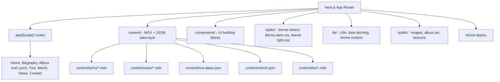

# Architecture

> Status: draft skeleton created in Phase 0.6. Will be finalized in Phase 6 once the design
> system, i18n, content layer, and pages exist.

## Overview

Cielo Rojo is a Next.js (App Router, TypeScript) site for a solo progressive/heavy metal album.
It is bilingual (English/Spanish) and supports light/dark themes. Content (biography, lyrics,
tour dates, merch, news) is stored as version-controlled files in `content/` and accessed through
typed functions in `lib/data/`, rather than a hosted CMS (see
[ADR 0003](adr/0003-file-based-content-layer.md)).



## Key principles

- **Content/code separation** — all editable content lives in `content/` as MDX/JSON, not
  hardcoded in components.
- **Data layer abstraction** — `lib/data/*.ts` functions (`getTourDates()`, `getSongs()`, etc.)
  read from local files now; swapping to an API/CMS later only touches these functions.
- **Locale-first routing** — `app/[locale]/...` with middleware detecting/redirecting based on
  browser language, falling back to `en`.
- **Theme via CSS variables**, toggled by a `data-theme="dark|light"` attribute on `<html>`,
  persisted in `localStorage`, respecting `prefers-color-scheme` on first visit.

## Folder structure

```
cielo-rojo/
├── app/
│   ├── [locale]/
│   │   ├── layout.tsx
│   │   ├── page.tsx                 # Home / hero
│   │   ├── biography/page.tsx
│   │   ├── album/
│   │   │   ├── page.tsx             # Track listing
│   │   │   └── [track]/page.tsx     # Lyrics + player per song
│   │   ├── tour/page.tsx
│   │   ├── merch/page.tsx
│   │   ├── news/
│   │   │   ├── page.tsx
│   │   │   └── [slug]/page.tsx
│   │   └── contact/page.tsx
│   └── globals.css
├── components/
│   ├── layout/ (Header, Footer, LanguageSwitcher, ThemeToggle)
│   ├── ui/ (Button, Card, Badge, Section, Container)
│   ├── album/ (TrackList, LyricsViewer, PlayerEmbed)
│   ├── tour/ (TourDateCard, TourList)
│   ├── merch/ (MerchCard, MerchGrid)
│   └── news/ (NewsCard, NewsList)
├── content/
│   ├── bio/{en,es}.mdx
│   ├── lyrics/{track-slug}/{en,es}.mdx
│   ├── news/{slug}/{en,es}.mdx
│   ├── tour-dates.json
│   ├── merch.json
│   └── social-links.json
├── lib/
│   ├── i18n/ (config, dictionaries)
│   ├── data/ (getTourDates.ts, getSongs.ts, getNews.ts, getMerch.ts, getBio.ts)
│   └── theme/ (ThemeProvider.tsx)
├── styles/
│   ├── tokens.css
│   ├── theme-dark.css
│   └── theme-light.css
├── public/
├── docs/
│   ├── ARCHITECTURE.md (this file)
│   ├── CONTENT-GUIDE.md
│   ├── IMPLEMENTATION-PLAN.md
│   └── adr/
├── .github/workflows/ci.yml
├── CHANGELOG.md
├── README.md
└── package.json
```

## Data flow (content layer)

1. Content author edits/adds a file under `content/` (see
   [CONTENT-GUIDE.md](CONTENT-GUIDE.md)).
2. A typed accessor in `lib/data/*.ts` reads and parses the file (frontmatter via `gray-matter`,
   body rendered via `react-markdown` + `remark-gfm`) at build/request time.
3. Server components in `app/[locale]/**` call the accessor and render the result — no content
   is fetched client-side.

## To be completed in Phase 6

- Finalized component inventory once Phase 1/5 land.
- Sequence/interaction notes for the theme toggle and locale switch.
- Deployment topology diagram once Vercel is connected (Phase 0.7) and the domain is live
  (Phase 8).
